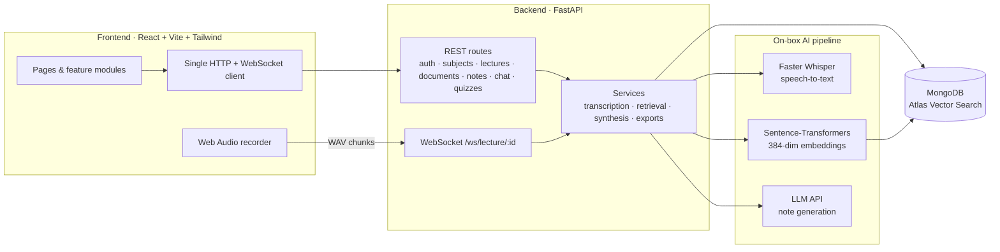
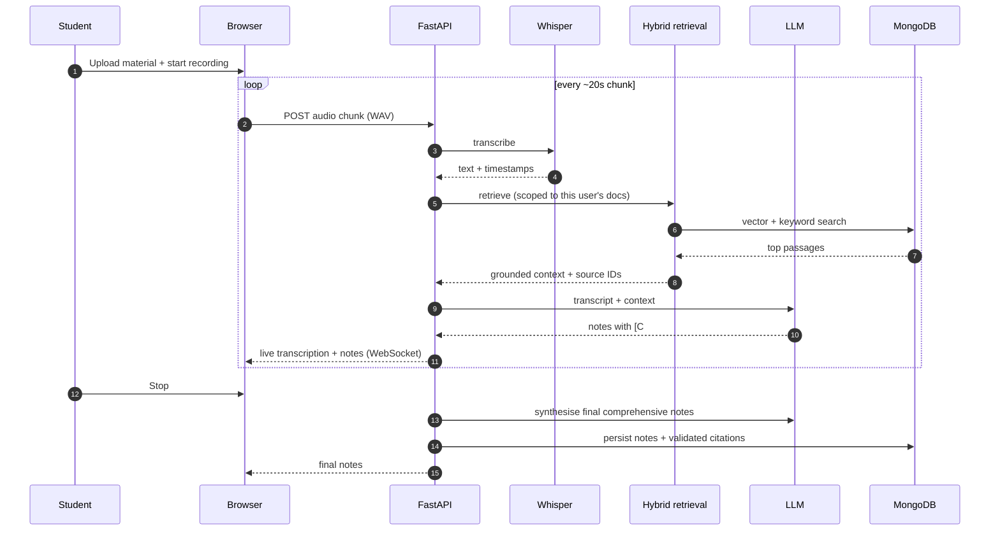
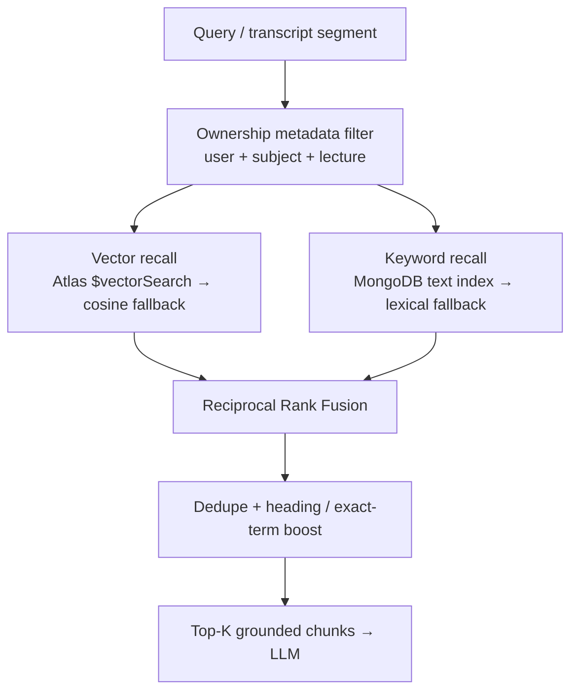
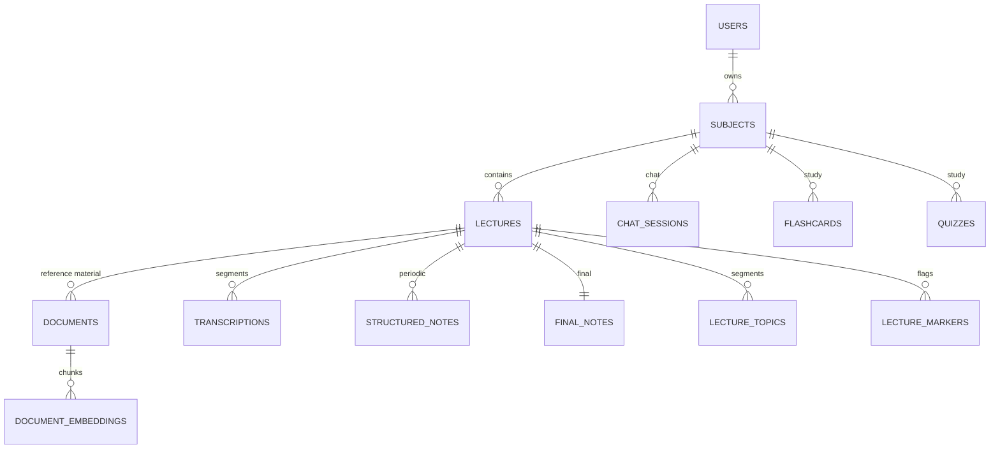

<div align="center">

# 🎙️ LectureWeave

### Turn live lectures into structured, source-grounded study notes — in real time.

LectureWeave records a lecture from the browser, transcribes it as you speak,
retrieves the most relevant passages from **your own uploaded course material**,
and weaves them into notes that grow live and finalise when you stop — every
claim traceable to its source.


</div>

---

## ✨ Why it's different

Most transcription tools generate notes from audio alone and hallucinate on
unclear speech. LectureWeave is built around **RAG-assisted note generation**:
your uploaded PDFs / slides ground every note, so the output stays faithful to
the material and each statement carries a clickable **`[C#]` citation** back to
the exact page, slide, or transcript moment.

---

## 🚀 Features

| Capture & notes | Trust & study |
| --- | --- |
| 🎧 Live browser recording → WAV chunks | 🔖 Source citations on every note `[C1]`, `[C2]` |
| ✍️ Live transcription with **editable** segments | 💬 Subject-wide grounded **chat** over your material |
| ⏱️ Timestamped transcript timeline | 🧠 Grounded **flashcards** & **quizzes** |
| 🗂️ Periodic structured notes + final comprehensive notes | 🧭 Automatic **topic segmentation** |
| 🎯 Important / Confusing / Exam-hint **markers** | 📤 Export to **Markdown / TXT / PDF / DOCX** |
| 🧾 Note styles (concise, detailed, bullets, revision, summary) | 🔁 Idempotent **retry** for failed processing |
| 📎 Structure-aware chunking (page / slide / heading) | 🔒 Per-user ownership on every resource |

Supported source formats: **PDF · PPTX · DOCX · TXT**.

---

## 🏗️ System architecture



---

## 🔄 How a lecture flows



---

## 🧩 Hybrid retrieval

Retrieval always applies a **mandatory ownership filter** first, then fuses two
complementary signals — so exact terms, formulas, and acronyms are matched as
well as semantic meaning. Runs on **MongoDB Atlas Free Tier** (with an in-memory
cosine fallback when `$vectorSearch` isn't available).



---

## 🗃️ Data model (core collections)



---

## 🧱 Tech stack

| Layer | Technology |
| --- | --- |
| Frontend | React 18 · Vite · Tailwind CSS · React Router |
| Recording | Browser Web Audio API → 16 kHz mono WAV |
| Backend | Python 3.11 · FastAPI · WebSockets |
| Transcription | Faster Whisper (local, CPU-friendly) |
| Embeddings | Sentence-Transformers `all-MiniLM-L6-v2` (384-dim) |
| Retrieval | Hybrid vector + keyword + Reciprocal Rank Fusion |
| Generation | Hosted **LLM API** (provider-agnostic) |
| Persistence | MongoDB (Motor / PyMongo) + Atlas Vector Search |
| Live updates | Per-lecture WebSocket |

Canonical backend entry point: **`uvicorn app.main:app`**.

---

## ⚡ Quick start

Prerequisites: Python 3.11, Node.js 18+, and MongoDB (local or Atlas). An LLM
API key is required for note generation.

**Option A — Docker (recommended):** brings up MongoDB + backend with a
persistent model cache.

```bash
cp backend/.env.example backend/.env   # set MONGODB_URL, JWT_SECRET_KEY, your LLM API key
docker compose up -d
cd frontend && npm install && npm run dev   # http://localhost:3000
```

**Option B — local processes:**

```bash
# Backend
cd backend
python -m venv venv
# Windows: venv\Scripts\activate   |   macOS/Linux: source venv/bin/activate
pip install -r requirements.txt
cp .env.example .env
uvicorn app.main:app --reload        # http://localhost:8000

# Frontend (new terminal)
cd frontend
npm install
cp .env.example .env
npm run dev                          # http://localhost:3000
```

Full walkthrough: [docs/local-development.md](docs/local-development.md).

---

## 🔧 Configuration

Copy the templates and fill in real values — **never commit a real `.env`**:

- Backend: [`backend/.env.example`](backend/.env.example)
- Frontend: [`frontend/.env.example`](frontend/.env.example)

Every variable is documented in [docs/configuration.md](docs/configuration.md).

---

## ✅ Testing

```bash
# Backend
cd backend && pytest -q

# Frontend
cd frontend && npm run lint && npm run test && npm run build
```

CI (GitHub Actions) runs backend tests, a frontend lint/test/build, and a
secret scan on every push. Details: [docs/testing.md](docs/testing.md).

---

## 📁 Repository structure

```text
lectureweave/
├── frontend/                       React + Vite client
│   └── src/
│       ├── api/                    One HTTP client, one WebSocket client, endpoint modules
│       ├── components/             MarkdownView (Markdown + KaTeX) and shared UI
│       ├── config/                 environment.js (reads Vite env vars)
│       ├── contexts/               AuthContext (JWT session state)
│       ├── features/               transcripts · documents · recording · notes ·
│       │                           citations · subject-chat · flashcards · quizzes · topics
│       └── pages/                  Route-backed screens
├── backend/
│   ├── app/
│   │   ├── api/                    Route modules (auth, subjects, lectures, documents,
│   │   │                           recording, notes, chat, flashcards, quizzes, topics, health)
│   │   ├── core/                   config · security · lifespan
│   │   ├── db/repositories/        Ownership-scoped data access
│   │   ├── schemas/                Pydantic request/response models
│   │   ├── services/               transcription · documents · retrieval · synthesis ·
│   │   │                           recording · chat · flashcards · quizzes · topics
│   │   └── main.py                 Canonical FastAPI app
│   ├── database/                   MongoDB connection + helpers
│   └── tests/                      unit · api · integration
├── docs/                           Architecture, retrieval, citations, deployment, …
├── docker-compose.yml
└── README.md
```

---

## 🚢 Deployment

Containerised backend + MongoDB via `docker-compose.yml`; frontend builds to a
static bundle deployable on any static host. Runs within free-tier limits
(Atlas M0 with the hybrid-retrieval fallback). See
[docs/deployment.md](docs/deployment.md) and
[docs/free-tier.md](docs/free-tier.md).

---

## 🔐 Security

JWT auth, per-user ownership enforced server-side on every resource, and no
secrets in source. Policy and reporting: [SECURITY.md](SECURITY.md).

---

## 📚 Documentation

[Architecture](docs/architecture.md) ·
[Retrieval](docs/retrieval.md) ·
[Citations](docs/citations.md) ·
[Authentication](docs/authentication.md) ·
[Database](docs/database.md) ·
[Configuration](docs/configuration.md) ·
[Testing](docs/testing.md) ·
[Deployment](docs/deployment.md) ·
[Free-tier notes](docs/free-tier.md)
